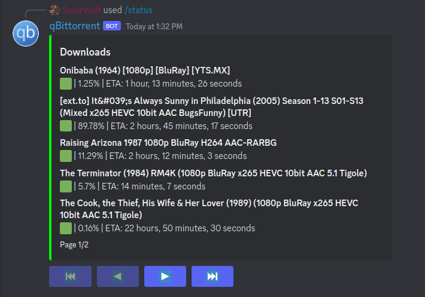

# qBitBot
A simple Discord bot to see your current downloads on qBittorrent.

## Setup
Either clone the repo locally and setup environment variables:
```shell
git clone https://github.com/SolarWolf-Code/qbitbot.git
pip install -r requirements.txt
export HOST=YOUR_QBITTORRENT_CLIENT_URL # e.g. localhost
export PORT=YOUR_QBITTORRENT_CLIENT_PORT # e.g. 8080
export USERNAME=YOUR_QBITTORRENT_CLIENT_USERNAME # e.g. admin
export PASSWORD=YOUR_QBITTORRENT_CLIENT_PASSWORD # e.g. adminadmin
export GUILD_ID=YOUR_DISCORD_SERVER_ID # e.g. 123456789012345678
export TOKEN=YOUR_DISCORD_BOT_TOKEN # e.g. abcdefghijklmnopqrstuvwxyz.1234567890.abcdefghijklmnopqrstuvwxyz
export ELEMENTS_PER_PAGE # e.g. 5
```

Or you can use Docker:
```shell
docker pull solarwolf/qbitbot
docker run -d \
  --name my_qbitbot_container \
  -e HOST=YOUR_QBITTORRENT_CLIENT_URL \
  -e PORT=YOUR_QBITTORRENT_CLIENT_PORT \
  -e USERNAME=YOUR_QBITTORRENT_CLIENT_USERNAME \
  -e PASSWORD=YOUR_QBITTORRENT_CLIENT_PASSWORD \
  -e GUILD_ID=YOUR_DISCORD_SERVER_ID \
  -e TOKEN=YOUR_DISCORD_BOT_TOKEN \
  -e ELEMENTS_PER_PAGE \
  solarwolf/qbitbot
```

Now you'll need to setup a Discord bot via the [Discord Developer Portal](https://discord.com/developers/applications/).
After you've created your bot, you'll need to add it to your server and give it the `Send Messages`, `Read Message History`, and `Manage Messages` permission.

## Usage
Once you've invited your bot, make sure it is online and type `/status` in any channel that the bot has access to.

